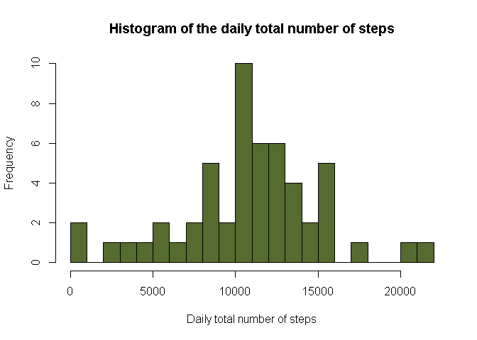
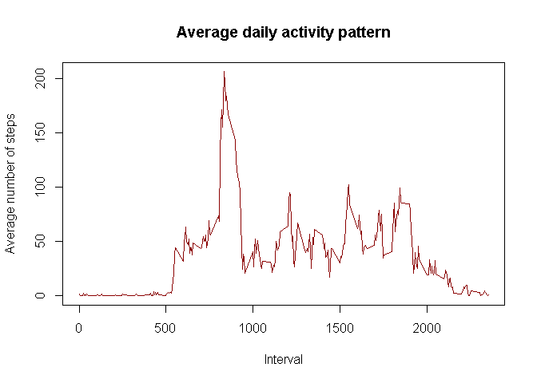
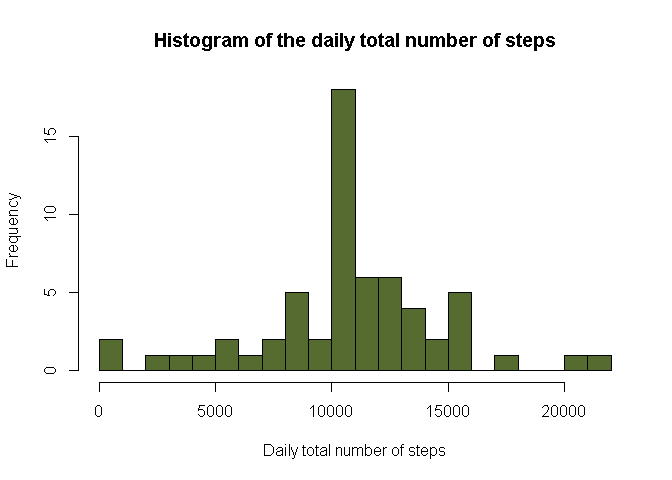
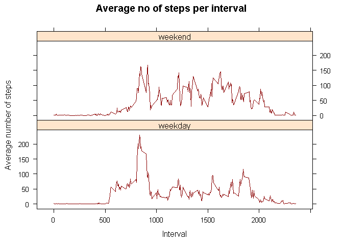

## Introduction

It is now possible to collect a large amount of data about personal movement using activity monitoring devices such as a Fitbit, Nike Fuelband, or Jawbone Up. These type of devices are part of the “quantified self” movement – a group of enthusiasts who take measurements about themselves regularly to improve their health, to find patterns in their behavior, or because they are tech geeks. But these data remain under-utilized both because the raw data are hard to obtain and there is a lack of statistical methods and software for processing and interpreting the data.

This assignment makes use of data from a personal activity monitoring device. This device collects data at 5 minute intervals through out the day. The data consists of two months of data from an anonymous individual collected during the months of October and November, 2012 and include the number of steps taken in 5 minute intervals each day.

The data for this assignment can be downloaded [here](https://d396qusza40orc.cloudfront.net/repdata%2Fdata%2Factivity.zip).

The variables included in this dataset are:

- **steps**: Number of steps taking in a 5-minute interval
- **date**: The date on which the measurement was taken in YYYY-MM-DD format
- **interval**: Identifier for the 5-minute interval in which measurement was taken

The dataset is stored in a comma-separated-value (CSV) file and there are a total of 17,568 observations in this dataset.

## Loading and preprocessing the data  

Loading the data:

```r
data <- read.csv(unzip("activity.zip"))
```
Looking at the structure of the data and the first few rows:

```r
str(data)
```

```
## 'data.frame':	17568 obs. of  3 variables:
##  $ steps   : int  NA NA NA NA NA NA NA NA NA NA ...
##  $ date    : chr  "2012-10-01" "2012-10-01" "2012-10-01" "2012-10-01" ...
##  $ interval: int  0 5 10 15 20 25 30 35 40 45 ...
```

```r
head(data)
```

```
##   steps       date interval
## 1    NA 2012-10-01        0
## 2    NA 2012-10-01        5
## 3    NA 2012-10-01       10
## 4    NA 2012-10-01       15
## 5    NA 2012-10-01       20
## 6    NA 2012-10-01       25
```
Converting the `date` column to `Date` class:

```r
data$date <- as.Date(data$date, "%Y-%m-%d")
class(data$date)
```

```
## [1] "Date"
```

## What is mean total number of steps taken per day?

Subsetting the dataset to obtain one with only the available values of `steps` variable:

```r
avlbl_steps <- data[!(is.na(data$steps)), ]
```
Obtaining a dataframe with the number of steps taken each day:

```r
daily_steps <- aggregate(steps ~ date, data = avlbl_steps, sum)
```
Making a histogram of the daily total number of steps:

```r
hist(daily_steps$steps, breaks = 20, col = "darkolivegreen", xlab = "Daily total number of steps", main = "Histogram of the daily total number of steps")
```


Calculating the mean and median of the total number of steps taken per day:

```r
mean(daily_steps$steps)
```

```
## [1] 10766.19
```

```r
median(daily_steps$steps)
```

```
## [1] 10765
```

## What is the average daily activity pattern?
Calculating the average number of steps taken, averaged across all days:

```r
steps_per_interval <- aggregate(avlbl_steps$steps, by = list(interval = avlbl_steps$interval), FUN = mean)
# Naming the columns
colnames(steps_per_interval) <- c("interval", "average_steps")
```
Making a time series plot of the 5-minute interval and the average number of steps taken, averaged across all days:

```r
with(steps_per_interval, plot(interval, average_steps, type = "l", xlab = "Interval", ylab = "Average number of steps", main = "Average daily activity pattern",  col ="darkred"))
```


The 5-minute interval, on average across all the days in the dataset, that contains the maximum number of steps:

```r
steps_per_interval[which.max(steps_per_interval$average_steps),]$interval
```

```
## [1] 835
```

## Imputing missing values

Calculating the number of rows with missing values in the dataset:

```r
sum(!complete.cases(data))
```

```
## [1] 2304
```
Using means for the intervals to substitute for missing values:

```r
comp_steps <- numeric()
for(i in 1:nrow(data)){
  if(is.na(data[i, ]$steps)){
    steps_sub <- subset(steps_per_interval, interval == data[i, ]$interval)$average_steps
  } else {
    steps_sub <- data[i, ]$steps
  }
  comp_steps <- c(comp_steps, steps_sub)
}
```
Creating a new dataset that is equal to the original dataset but with the missing data filled in:

```r
comp_data <- data
comp_data$steps <- comp_steps
```
Checking to see if the new dataset has any incomplete rows:

```r
sum(!complete.cases(comp_data))
```

```
## [1] 0
```
Making a histogram of the total number of steps taken each day for the new dataset:

```r
daily_steps_new <- aggregate(steps ~ date, data = comp_data, sum)
hist(daily_steps_new$steps, breaks = 20, col = "darkolivegreen", xlab = "Daily total number of steps", main = "Histogram of the daily total number of steps")
```


Calculating the mean and median of the total number of steps taken per day for the new dataset:

```r
mean(daily_steps_new$steps)
```

```
## [1] 10766.19
```

```r
median(daily_steps_new$steps)
```

```
## [1] 10766.19
```
Checking to see if these values differ from the estimates from the first part of the assignment:

```r
mean(daily_steps_new$steps) - mean(daily_steps$steps)
```

```
## [1] 0
```

```r
median(daily_steps_new$steps) - median(daily_steps$steps)
```

```
## [1] 1.188679
```
We see that the mean remains remains the same while the median differs slightly. Also, the 2 histograms make it clear that although the two frequency distributions peak around 10000, the second one (corresponding to the new dataset) has a smaller spread around the peak.    

## Are there differences in activity patterns between weekdays and weekends?

Creating a new factor variable in the dataset with two levels – “weekday” and “weekend” indicating whether a given date is a weekday or weekend day:

```r
wkdays <- c("Monday", "Tuesday", "Wednesday", "Thursday", "Friday")
for(i in 1:nrow(comp_data)){
  if (weekdays(comp_data$date[i]) %in% wkdays){
    comp_data$type[i] <- "weekday" 
  } else {
    comp_data$type[i] <- "weekend"
  }
}
comp_data$type <- as.factor(comp_data$type)
```
Making a panel plot containing a time series plot of the 5-minute interval and the average number of steps taken, averaged across all weekday days or weekend days:

```r
steps_by_type <- aggregate(steps ~ interval + type, data = comp_data, FUN = mean)
library(lattice)
with(steps_by_type, xyplot(steps ~ interval | type, main = "Average no of steps per interval", xlab = "Interval", ylab = "Average number of steps", layout = c(1,2), type = "l", col = "darkred"))
```



